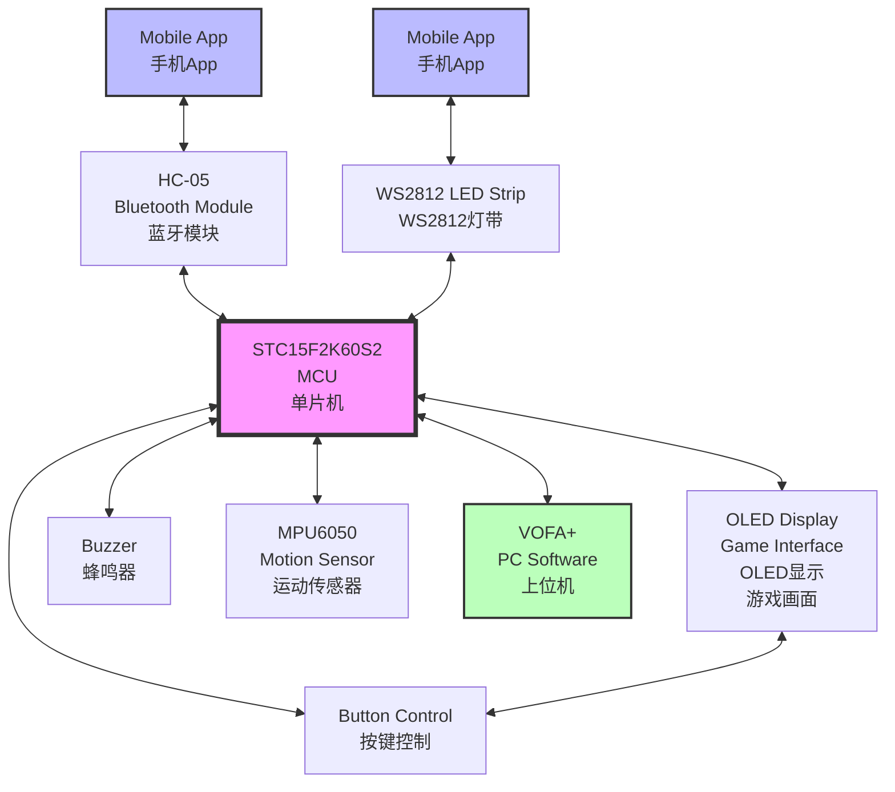

# 51MCU Handheld Gaming Console System

<div align="center">

| 🌍 Language / 语言 | 📖 Documentation / 文档 |
|:---:|:---:|
| **English** | [👉 Click Here / 点击这里](#english-version) |
| **中文** | [👉 点击这里 / Click Here](#中文版本) |

</div>

---

## English Version

```bash
# Navigate to Chinese version
echo "中文版本在下方 👇 Chinese version below"
```

[🔝 Back to Language Selection](#language-selection--语言选择) | [🇨🇳 中文版本](#中文版本)

### Project Overview

<div align="center">
  
  <br>
  <em>51MCU Handheld Gaming Console System - Complete Hardware Setup</em>
</div>

<br>

A multifunctional handheld gaming console system based on the **STC15F2K60S2 8051 microcontroller**, featuring both controller mode and gaming mode. The system supports motion sensing, RGB lighting control, Bluetooth communication, and multiple classic games.

#### System Architecture Diagram



**System Communication Protocols:**
- **I2C Bus**: MPU6050 ↔ MCU ↔ OLED Display
- **UART1**: MCU ↔ VOFA+ PC Software  
- **UART2**: MCU ↔ HC-05 Bluetooth Module
- **Single Wire**: MCU ↔ WS2812 LED Control
- **GPIO**: MCU ↔ Buttons & Buzzer

### Hardware Components

- **MCU**: STC15F2K60S2 8051 microcontroller
- **Motion Sensor**: MPU6050 (6-axis accelerometer and gyroscope)
- **Display**: 128x64 OLED I2C display
- **Lighting**: WS2812B RGB LED strip
- **Communication**: HC-05 Bluetooth module
- **Input**: Physical buttons for game control

### Hardware Connection Diagram

```yaml
# Hardware Configuration
MCU: "STC15F2K60S2 8051"
Power: "3.3V/5V Mixed System"
Communication: "I2C + UART + Single Wire"
```

```ascii
STC15F2K60S2 MCU
┌─────────────────┐
│    P1.0 ←──────┼──→ Left Button
│    P1.1 ←──────┼──→ Right Button  
│    P1.2 ←──────┼──→ Up Button
│    P1.3 ←──────┼──→ Down Button
│                │
│    P2.0 ←──────┼──→ WS2812B Data Line
│                │
│    P3.0 ←──────┼──→ UART1 RX (PC Communication)
│    P3.1 ←──────┼──→ UART1 TX (PC Communication)
│                │
│    P1.6 ←──────┼──→ UART2 RX (HC-05 Bluetooth)
│    P1.7 ←──────┼──→ UART2 TX (HC-05 Bluetooth)
│                │
│    P2.1 ←──────┼──→ I2C SDA (MPU6050 & OLED)
│    P2.2 ←──────┼──→ I2C SCL (MPU6050 & OLED)
└─────────────────┘
         │
         ▼
┌─────────────────┐     ┌─────────────────┐     ┌─────────────────┐
│    MPU6050      │     │   OLED Display  │     │    WS2812B      │
│   Motion Sensor │     │  128x64 I2C     │     │   RGB LED Strip │
│                 │     │                 │     │                 │
│  VCC ←─── 3.3V  │     │  VCC ←─── 3.3V  │     │  VCC ←─── 5V    │
│  GND ←─── GND   │     │  GND ←─── GND   │     │  GND ←─── GND   │
│  SDA ←─── P2.1  │     │  SDA ←─── P2.1  │     │  DIN ←─── P2.0  │
│  SCL ←─── P2.2  │     │  SCL ←─── P2.2  │     │                 │
└─────────────────┘     └─────────────────┘     └─────────────────┘

┌─────────────────┐
│    HC-05        │
│ Bluetooth Module│
│                 │
│  VCC ←─── 3.3V  │
│  GND ←─── GND   │
│  RX  ←─── P1.7  │
│  TX  ←─── P1.6  │
└─────────────────┘
```

### Main Features

#### 🎮 Controller Mode

1. **Motion Data Transmission**
   - Reads MPU6050 3-axis accelerometer and gyroscope data via I2C bus
   - Transmits real-time motion data to PC through UART1
   - Supports 3D visualization using VOFA+ software
   - Real-time display of controller movement status

2. **RGB Lighting Control**
   - Controls WS2812B LED strip through single data line
   - Generates colorful breathing light effects using timer PWM
   - Supports random color generation
   - Mobile app control via Bluetooth HC-05 module

#### 🕹️ Gaming Mode

**Supported Games:**
1. **Star Wars** - Space shooting adventure
2. **Dino Jump** - Obstacle jumping challenge  
3. **Tetris** - Classic puzzle game
4. **Snake** - Classic arcade game

**Gaming Features:**
- All games displayed on 128x64 OLED screen
- Physical button control for gameplay
- Bluetooth mobile app control for game selection
- Smooth graphics and responsive controls

### File Structure

```
PLAY_GAME/
├── main.c                  # Main program entry point
├── snake.c/snake.h         # Snake game implementation
├── tetris.c/tetris.h       # Tetris game implementation
├── oled.c/oled.h          # OLED display driver
├── oled_data.c/oled_data.h # OLED display data and sprites
├── MPU6050.c/MPU6050.h    # MPU6050 sensor driver
├── DMP.c/DMP.h            # Digital Motion Processing
├── bluetooth.c/bluetooth.h # Bluetooth communication
├── USART.c/USART.h        # UART communication
├── WS2812.c/WS2812.h      # WS2812B LED control
├── Soft_I2C.c/Soft_I2C.h  # Software I2C implementation
├── all.h                  # Global header file
├── stdint.h               # Standard integer types
├── PLAY_GAME.uvproj       # Keil project file
├── Objects/               # Compiled object files
└── Listings/              # Assembly listings
```

### Core Module Functions

#### Game Control System
- **Button Interface**: `leftkey()`, `rightkey()`, `upkey()`, `downkey()`
- **Game Logic**: Snake body rendering, food generation, collision detection
- **Score System**: Real-time scoring and high score tracking

#### Display Management
- **OLED Driver**: Low-level display control and initialization
- **Graphics Engine**: Sprite rendering, text display, animation
- **Game Assets**: Character data, sprites, and UI elements

#### Communication Modules
- **I2C Communication**: MPU6050 sensor and OLED display interface
- **UART Communication**: PC connection and Bluetooth module
- **Bluetooth Interface**: Wireless control and configuration

### Build Environment

- **IDE**: Keil uVision
- **Compiler**: Keil C51
- **Target MCU**: STC15F2K60S2
- **Project File**: `PLAY_GAME.uvproj`

### Getting Started

1. **Hardware Setup**
   - Connect all modules according to the hardware connection diagram
   - Ensure proper power supply (3.3V for sensors, 5V for LEDs)
   - Double-check I2C and UART connections

2. **Software Setup**
   - Open `PLAY_GAME.uvproj` in Keil uVision
   - Compile the project (Build → Rebuild All Target Files)
   - Download the program to STC15F2K60S2 microcontroller

3. **Operation**
   - Power on the device
   - Use physical buttons to switch between modes
   - In controller mode: Connect VOFA+ software to view motion data
   - In gaming mode: Select and play games using buttons or mobile app

### Technical Highlights

- **Dual-Mode Design**: Seamless switching between controller and gaming modes
- **Wireless Control**: Bluetooth connectivity for mobile app integration
- **Motion Sensing**: 6-axis sensor data acquisition and processing
- **Visual Effects**: Dynamic RGB lighting and crisp OLED game graphics
- **Classic Gaming**: Four different types of classic games implementation
- **Real-time Processing**: Efficient 8051 assembly and C programming

### Mobile App Integration

The system supports Bluetooth connectivity with mobile devices:
- Game selection and control
- RGB lighting effects customization
- Motion data visualization
- System configuration and settings

### Performance Specifications

- **Display Resolution**: 128x64 pixels
- **Motion Sensor**: 6-axis (3-axis accelerometer + 3-axis gyroscope)
- **LED Control**: Up to 8 WS2812B RGB LEDs
- **Communication Speed**: 9600 baud UART, 400kHz I2C
- **Response Time**: < 10ms for button inputs
- **Power Consumption**: < 200mA @ 5V

### Demo & Effects Showcase

#### 🎮 Controller Mode - Motion Sensing & RGB Effects
<div align="center">
  
  <br>
  <em>Controller Mode: Real-time motion data visualization with VOFA+ and RGB lighting effects</em>
</div>

**Features Demonstrated:**
- MPU6050 motion sensor data acquisition
- Real-time 3D visualization using VOFA+ software
- Dynamic RGB breathing light effects
- Bluetooth mobile app control integration

#### 🕹️ Gaming Mode - Classic Games Collection
<div align="center">
  <table>
    <tr>
      <td align="center">
        
        <br>
        <em>Classic Games: Snake & Tetris on OLED Display</em>
      </td>
      <td align="center">
        
        <br>
        <em>Action Games: Star Wars & Dino Jump Adventures</em>
      </td>
    </tr>
  </table>
</div>

**Gaming Features:**
- Four classic games with smooth 128x64 OLED graphics
- Responsive button controls for optimal gaming experience
- Score tracking and game state management
- Bluetooth game selection via mobile app

---

## 中文版本

```bash
# Navigate to English version  
echo "English version above 👆 英文版本在上方"
```

[🔝 返回语言选择](#language-selection--语言选择) | [🇺🇸 English Version](#english-version)

### 项目概述

<div align="center">
  
  <br>
  <em>51MCU掌上游戏机系统 - 完整硬件配置</em>
</div>

<br>

基于 **STC15F2K60S2 8051 单片机**实现的多功能掌上游戏机系统，具有手柄模式和游戏机模式两种工作模式。系统支持运动感应、RGB灯效控制、蓝牙通信和多款经典游戏。

#### 系统架构框图


**系统通信协议：**
- **I2C总线**: MPU6050 ↔ 单片机 ↔ OLED显示屏
- **UART1串口**: 单片机 ↔ VOFA+上位机软件  
- **UART2串口**: 单片机 ↔ HC-05蓝牙模块
- **单线协议**: 单片机 ↔ WS2812 LED控制
- **GPIO接口**: 单片机 ↔ 按键和蜂鸣器

### 硬件组件

- **主控**: STC15F2K60S2 8051 单片机
- **运动传感器**: MPU6050 (六轴加速度计和陀螺仪)
- **显示屏**: 128x64 OLED I2C 显示屏
- **灯效**: WS2812B RGB LED 灯带
- **通信**: HC-05 蓝牙模块
- **输入**: 物理按键用于游戏控制

### 硬件连接示意图

```yaml
# 硬件配置
主控芯片: "STC15F2K60S2 8051"
电源系统: "3.3V/5V混合供电"
通信方式: "I2C + UART + 单线协议"
```

```ascii
STC15F2K60S2 单片机
┌─────────────────┐
│    P1.0 ←──────┼──→ 左键
│    P1.1 ←──────┼──→ 右键  
│    P1.2 ←──────┼──→ 上键
│    P1.3 ←──────┼──→ 下键
│                │
│    P2.0 ←──────┼──→ WS2812B 数据线
│                │
│    P3.0 ←──────┼──→ UART1 RX (PC通信)
│    P3.1 ←──────┼──→ UART1 TX (PC通信)
│                │
│    P1.6 ←──────┼──→ UART2 RX (HC-05蓝牙)
│    P1.7 ←──────┼──→ UART2 TX (HC-05蓝牙)
│                │
│    P2.1 ←──────┼──→ I2C SDA (MPU6050和OLED)
│    P2.2 ←──────┼──→ I2C SCL (MPU6050和OLED)
└─────────────────┘
         │
         ▼
┌─────────────────┐     ┌─────────────────┐     ┌─────────────────┐
│    MPU6050      │     │   OLED显示屏    │     │    WS2812B      │
│   运动传感器     │     │  128x64 I2C     │     │   RGB LED灯带   │
│                 │     │                 │     │                 │
│  VCC ←─── 3.3V  │     │  VCC ←─── 3.3V  │     │  VCC ←─── 5V    │
│  GND ←─── GND   │     │  GND ←─── GND   │     │  GND ←─── GND   │
│  SDA ←─── P2.1  │     │  SDA ←─── P2.1  │     │  DIN ←─── P2.0  │
│  SCL ←─── P2.2  │     │  SCL ←─── P2.2  │     │                 │
└─────────────────┘     └─────────────────┘     └─────────────────┘

┌─────────────────┐
│    HC-05        │
│    蓝牙模块      │
│                 │
│  VCC ←─── 3.3V  │
│  GND ←─── GND   │
│  RX  ←─── P1.7  │
│  TX  ←─── P1.6  │
└─────────────────┘
```

### 主要功能

#### 🎮 手柄模式

1. **运动数据传输**
   - 通过I2C总线读取MPU6050三轴加速度和陀螺仪数据
   - 通过UART1串口实时传输运动数据给PC
   - 支持使用VOFA+软件进行三维可视化
   - 实时呈现手柄运动状态

2. **RGB灯效控制**
   - 通过单根数据线控制WS2812B LED灯带
   - 使用定时器PWM生成多彩呼吸灯效果
   - 支持随机颜色生成
   - 通过HC-05蓝牙模块支持手机App控制

#### 🕹️ 游戏机模式

**支持游戏:**
1. **星球大战** - 太空射击冒险
2. **小恐龙跳一跳** - 障碍跳跃挑战  
3. **俄罗斯方块** - 经典益智游戏
4. **贪吃蛇** - 经典街机游戏

**游戏特色:**
- 所有游戏在128x64 OLED屏幕上显示
- 物理按键控制游戏操作
- 蓝牙手机App控制游戏选择
- 流畅图形和响应式控制

### 文件结构

```
PLAY_GAME/
├── main.c                  # 主程序入口
├── snake.c/snake.h         # 贪吃蛇游戏实现
├── tetris.c/tetris.h       # 俄罗斯方块游戏实现
├── oled.c/oled.h          # OLED显示驱动
├── oled_data.c/oled_data.h # OLED显示数据和精灵
├── MPU6050.c/MPU6050.h    # MPU6050传感器驱动
├── DMP.c/DMP.h            # 数字运动处理
├── bluetooth.c/bluetooth.h # 蓝牙通信
├── USART.c/USART.h        # 串口通信
├── WS2812.c/WS2812.h      # WS2812B LED控制
├── Soft_I2C.c/Soft_I2C.h  # 软件I2C实现
├── all.h                  # 全局头文件
├── stdint.h               # 标准整数类型
├── PLAY_GAME.uvproj       # Keil工程文件
├── Objects/               # 编译对象文件
└── Listings/              # 汇编清单
```

### 核心模块功能

#### 游戏控制系统
- **按键接口**: `leftkey()`, `rightkey()`, `upkey()`, `downkey()`
- **游戏逻辑**: 蛇身渲染、食物生成、碰撞检测
- **计分系统**: 实时计分和最高分记录

#### 显示管理
- **OLED驱动**: 底层显示控制和初始化
- **图形引擎**: 精灵渲染、文本显示、动画
- **游戏资源**: 字符数据、精灵和UI元素

#### 通信模块
- **I2C通信**: MPU6050传感器和OLED显示接口
- **串口通信**: PC连接和蓝牙模块
- **蓝牙接口**: 无线控制和配置

### 编译环境

- **IDE**: Keil uVision
- **编译器**: Keil C51
- **目标MCU**: STC15F2K60S2
- **工程文件**: `PLAY_GAME.uvproj`

### 快速开始

1. **硬件搭建**
   - 按照硬件连接示意图连接所有模块
   - 确保正确的电源供应(传感器3.3V，LED 5V)
   - 仔细检查I2C和UART连接

2. **软件设置**
   - 在Keil uVision中打开`PLAY_GAME.uvproj`
   - 编译工程 (Build → Rebuild All Target Files)
   - 将程序下载到STC15F2K60S2单片机

3. **操作使用**
   - 给设备上电
   - 使用物理按键切换模式
   - 手柄模式：连接VOFA+软件查看运动数据
   - 游戏模式：使用按键或手机App选择和游玩游戏

### 技术亮点

- **双模式设计**: 手柄和游戏模式之间无缝切换
- **无线控制**: 蓝牙连接支持手机App集成
- **运动感应**: 六轴传感器数据采集和处理
- **视觉效果**: 动态RGB灯效和清晰OLED游戏图形
- **经典游戏**: 四种不同类型经典游戏实现
- **实时处理**: 高效的8051汇编和C语言编程

### 手机App集成

系统支持与移动设备的蓝牙连接:
- 游戏选择和控制
- RGB灯效定制
- 运动数据可视化
- 系统配置和设置

### 性能规格

- **显示分辨率**: 128x64 像素
- **运动传感器**: 六轴(三轴加速度计 + 三轴陀螺仪)
- **LED控制**: 最多8个WS2812B RGB LED
- **通信速度**: 9600波特率UART，400kHz I2C
- **响应时间**: 按键输入 < 10ms
- **功耗**: < 200mA @ 5V

### 演示效果展示

#### 🎮 手柄模式 - 运动感应与RGB灯效
<div align="center">
  
  <br>
  <em>手柄模式：VOFA+实时运动数据可视化与RGB呼吸灯效果</em>
</div>

**演示功能:**
- MPU6050运动传感器数据采集
- 使用VOFA+软件实时三维可视化
- 动态RGB呼吸灯效果
- 蓝牙手机App控制集成

#### 🕹️ 游戏模式 - 经典游戏合集
<div align="center">
  <table>
    <tr>
      <td align="center">
        
        <br>
        <em>经典游戏：OLED显示屏上的贪吃蛇与俄罗斯方块</em>
      </td>
      <td align="center">
        
        <br>
        <em>动作游戏：星球大战与小恐龙跳一跳冒险</em>
      </td>
    </tr>
  </table>
</div>

**游戏特色:**
- 四款经典游戏，128x64 OLED流畅图形显示
- 响应式按键控制，优化游戏体验
- 分数记录和游戏状态管理
- 蓝牙手机App游戏选择功能